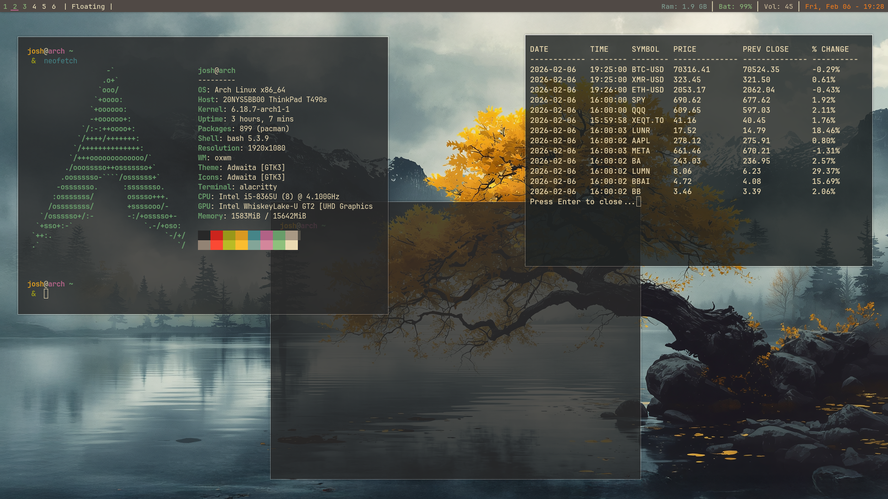
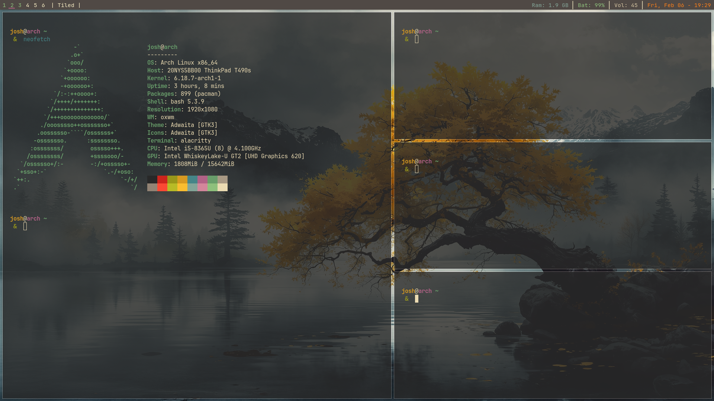

collection of dot config files for OXWM with a simple install script for a fresh Arch linux with yay

Arch bootable usb

iwctl
device wlan0 station\
station wlan0 scan\
station wlan0 connect SSID\
Enter password / exit.

Install arch.\
Audio: pulse\
Network, copy from ISO or NetworkManager

sudo pacman -Syu \
sudo pacman -S git base-devel xorg xorg-xinit xorg-xrandr\
mkdir Install

Install YAY\
git clone https://aur.archlinux.org/yay.git\
cd yay\
makepkg -si

Install this Desktop\
git clone https://github.com/MarshmelloVapes/OXWM-DE.git\
cd oxwm-de\
sudo chmod +x set-oxwm\
./set-oxwm

This script sets up the basic system that I am personally after.

# Questrade Setup
1) Install Wine
2) Install WineTricks
3) Install Vulkan
4) Create new wine prefix, 64 bit.
5) Set wineprefix:
    1) winetricks dxvk
    2) winetricks d3dcompiler_47 d3dx11_43
    3) winetricks corefonts dotnet48
    4) Install Questrade Edge
6) Set up Alias to access prefix and run Questrade Edge

# Screenshots

